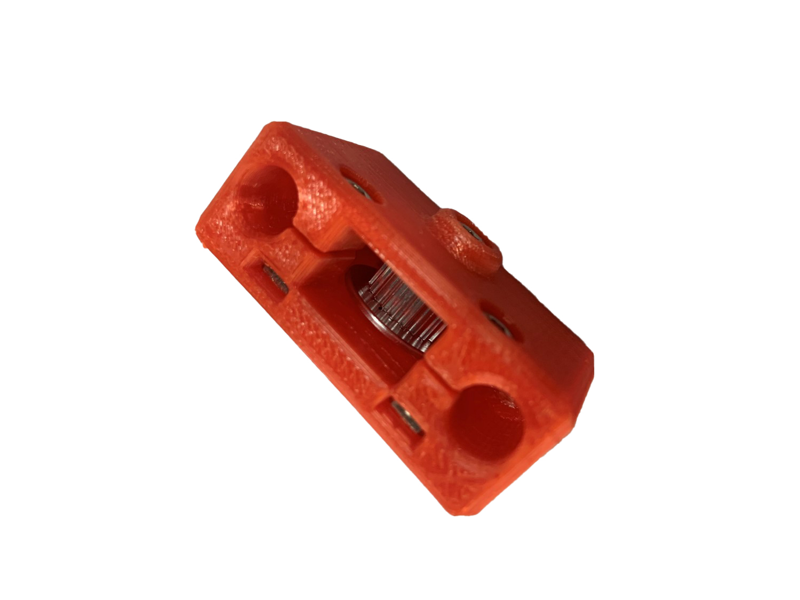
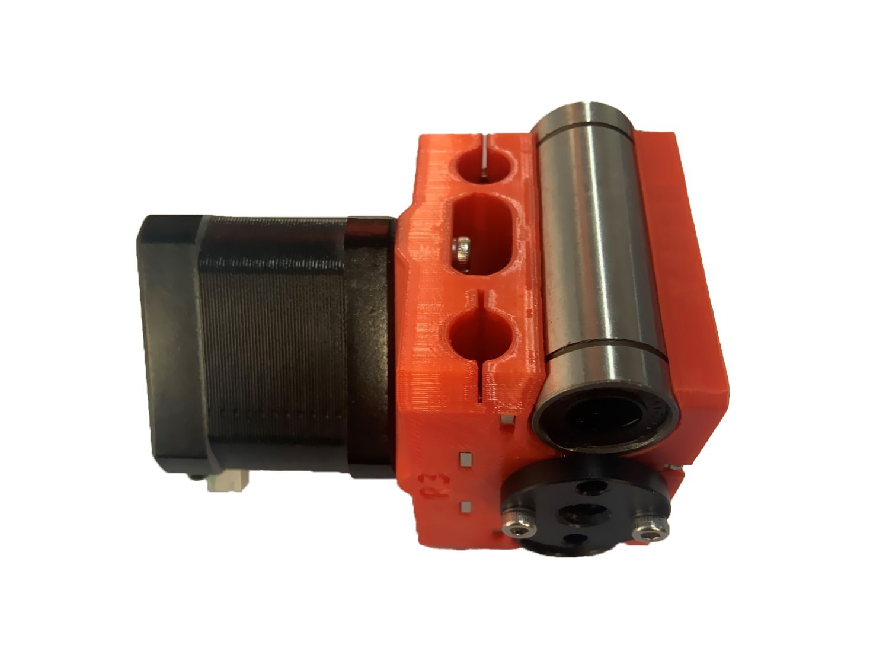
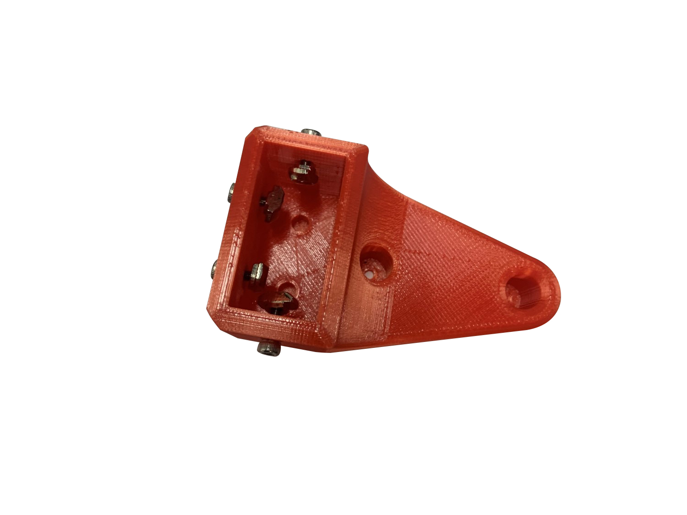
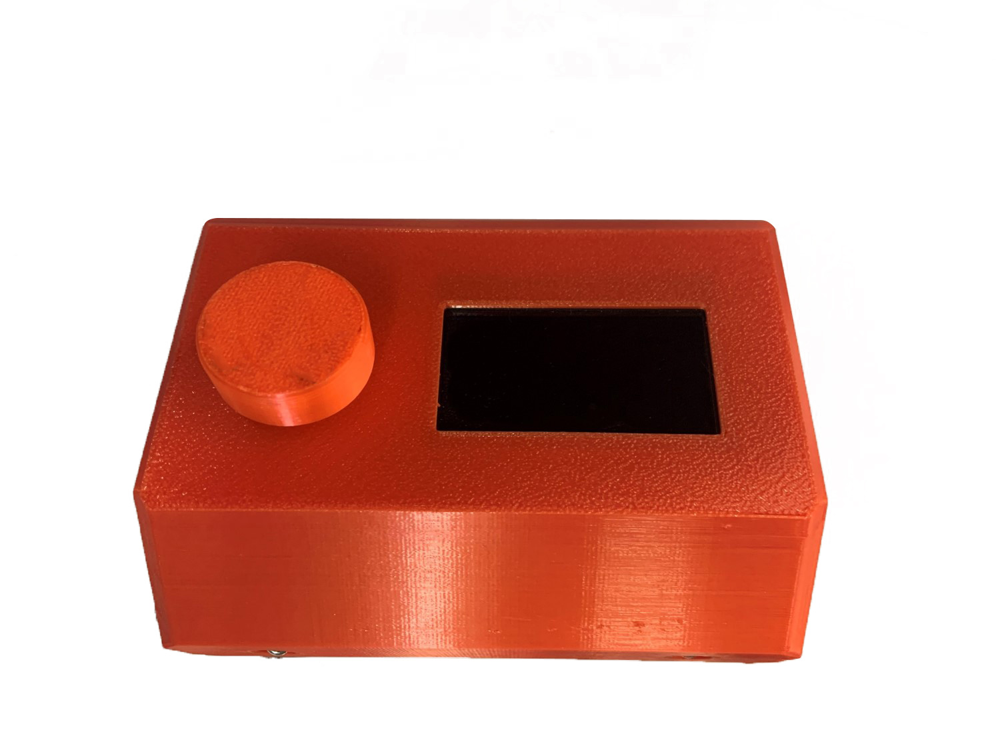

## Installation

You need to follow the following steps to build this machine.

1. Print all the STL files in `STLs` folder.
2. Get all the parts in BOM file.
3. Follow the steps bellow to build.

