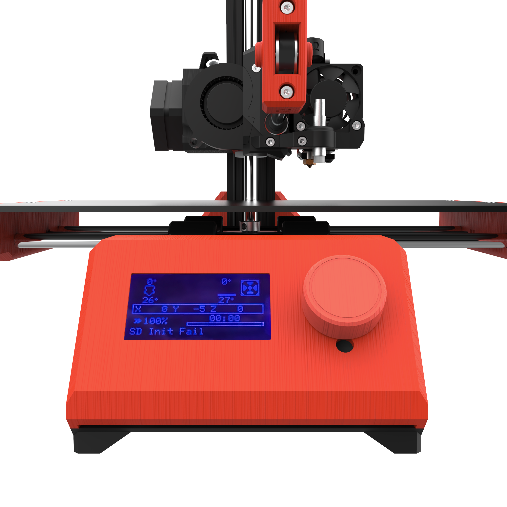

# F-MINI

This is our open source machine: F-mini. Welcome to give us suggestions. We will keep updating this machine. You can open `F-MINI.step` file to have a 3D view. 

## Firmware

Firmware is in the `firmware` folder. Follow the `README.md` there. 

## Installation

Please follow the `installation.md` .