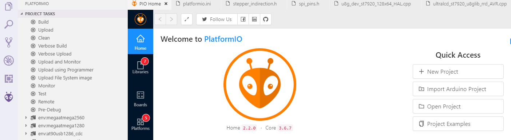
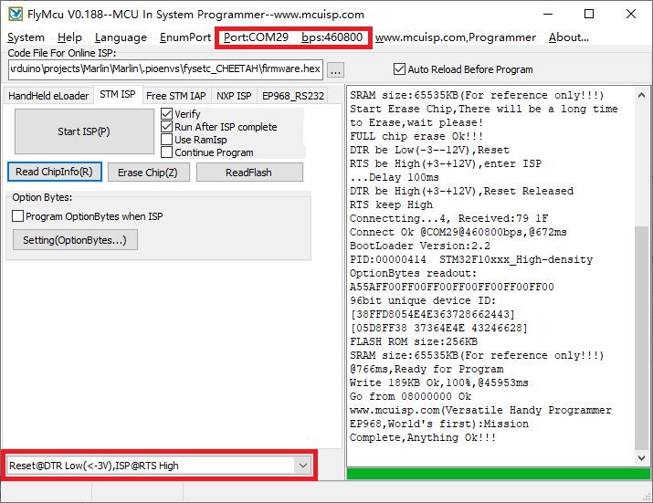
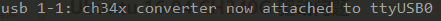

# Firmware guide

F-MINI build with [FYSETC-AIO_II](https://github.com/FYSETC/FYSETC-AIO_II) motherboard using `Marlin` firmware.

## Marlin

### Pre-buids

There is `firmware.hex` pre-build firmware for you to test the board if you can't drive F-MINI with your own firmware.

### Build the firmware

You can follow the following steps to build the firmware your self.

#### Download Vscode + platformio

To compile the firmware , you need to install Visual Studio Code and the platformio pulg-in.

#### Download firmware

If you download already downloaded this repo, the firmware is in the ```firmware``` folder.

#### Configure the firmware

If you don't change anything of the machine, you don't need to change the configuration.

#### Compile the firmware

Open Vscode and open platformio main page and click the "Open Project" button , and direct to the folder where you put your firmware.



If everything goes fine , at the bottom you can see several buttons


Then click check mark to compile.

If you can't generate the hex file, you may need to open vscode using Administrator Account .

For more detail information，you can refer to http://marlinfw.org/docs/basics/install_platformio.html

#### Upload the firmware(windows,linux,Mac)

We provide several ways to upload the firmware .You can just click the upload button to upload the firmware or refer to the two methods below.

#### Upload the firmware(windows)

After compiling , you should see the firmware file "firmware.hex" in the folder FIRMWARE_LOCATE\Marlin\Marlin\\.pioenvs\fysetc_STM32F1\

Download the flash software in our github https://github.com/FYSETC/STM32Flasher

Connect the board and your pc with USB cable (This step should before you open the software)

Double the click "FlyMcu.exe" software to open it.




1. Select "***Reset@DTR low(<-3v),ISP @RTS High***"
2. Click "Port" to select the port of your USB 
3. Select ***FIRMWARE_LOCATE\Marlin\Marlin\\.pioenvs\fysetc_STM32F1\firmware.hex*** as the screenshot shows.
4. At last ,click the "Start ISP(p)" to upload the firmware.

#### Upload the firmware(linux)

##### Load usb driver

Delete the old version driver /lib/modules/$(uname -r)/kernel/drivers/usb/serial/ch341.ko

```
rm /lib/modules/$(uname -r)/kernel/drivers/usb/serial/ch341.ko
```

Download the CH34x driver(linux version) from our github

https://github.com/FYSETC/CH340-Driver

follow the readme.txt to make and load the driver .

If you want the driver load automatically every time your PC power up. You can copy the ch34x.ko file to 

directory /lib/modules/$(uname -r)/kernel/drivers/usb/serial/ , and do

```
depmod 
```

##### Install stm32flash tool

First get the code

```
git clone https://git.code.sf.net/p/stm32flash/code stm32flash-code
```

Then follow the INSTALL file to install the software

##### Upload the firmware

Connect the motherboard with USB cable and your PC. And do

```
dmesg
```

And you will get message like 



the ttyUSB0 is the port to communicate with the motherboard.

And then go the the firmware.hex file location directory and do the follow command to upload the firmware

```
 stm32flash -w firmware.hex -v -i rts,-dtr /dev/ttyUSB0
```

## Bootloader

If you want to update the firmware from sdcard, you can try this [bootloader.](https://github.com/FYSETC/Bootloader-STM32F103) Follow the README there. Or use the pre-build one in ```bootloader``` folder besides this README.